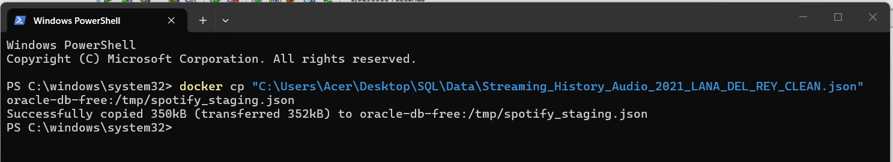
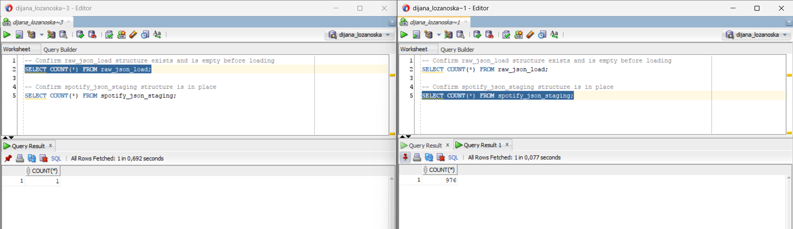
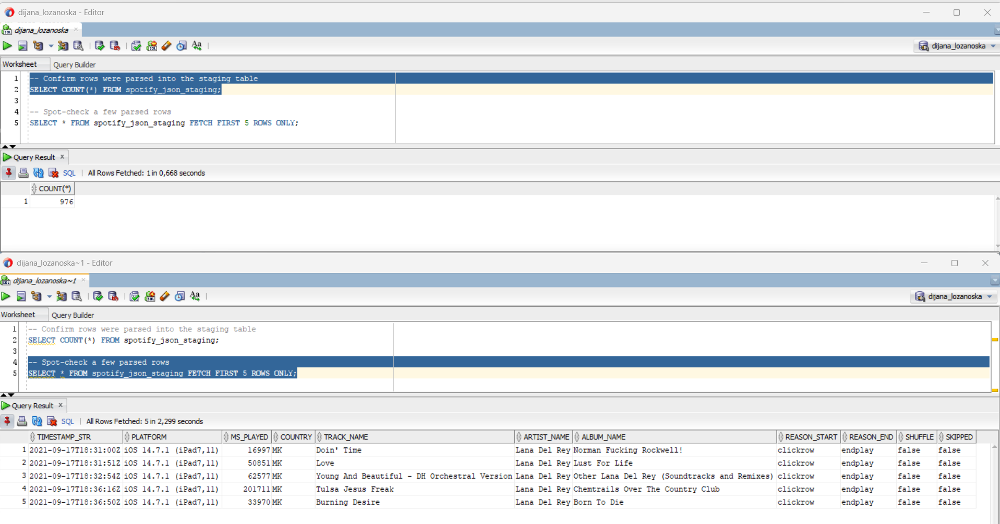
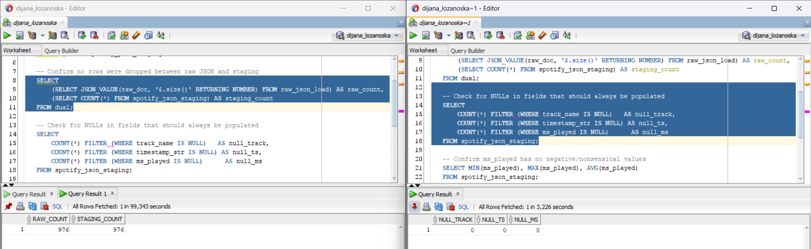
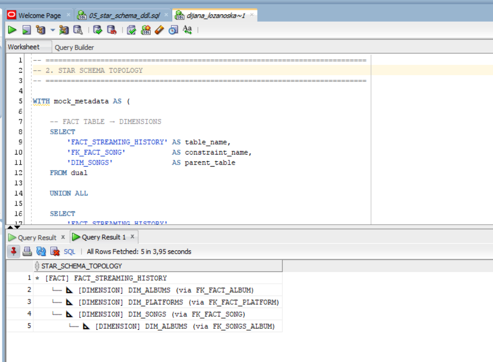
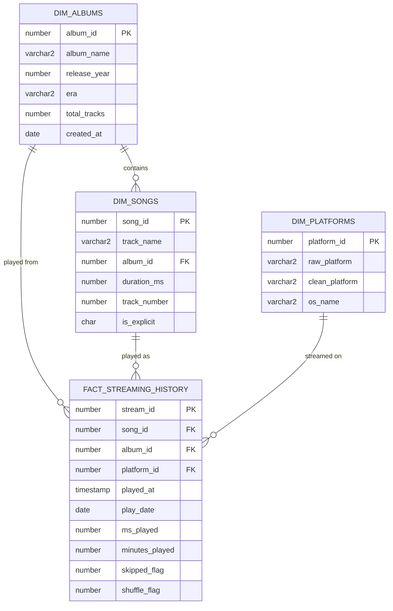
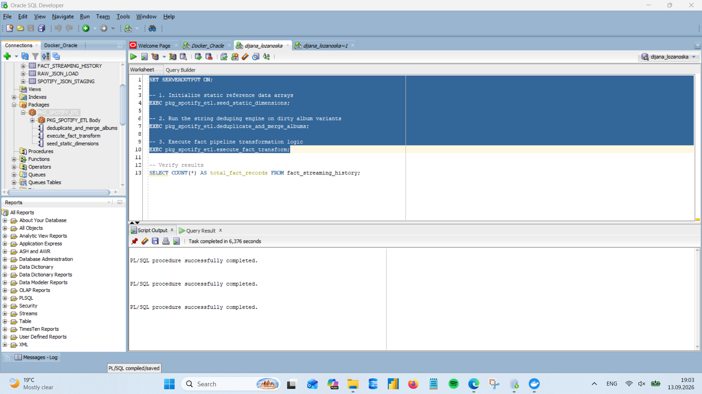

# 🎧 Lana Del Rey Spotify Listening Advanced Data Analytics Pipeline

**End-to-End Data Analytics Project**

`Python` • `Docker` • `Oracle SQL` • `Star Schema Modelling` • `ETL` • `Power BI` • `DAX`

---

## Project overview

This project presents an end-to-end analysis of Lana Del Rey listening activity using my own personal Spotify Extended Streaming History data, transforming raw JSON data into a dimensional data warehouse in Oracle SQL and an interactive Power BI dashboard. 

The main analytical focus is Lana Del Rey listening behaviour, with the Oracle layer responsible for standardizing source data and preparing it for Power BI.

The project follows this general architecture:  

```

   Spotify Extended Streaming History
         Raw JSON Data
                │
                ▼
     Python Data Cleaning
       VS Code / MacBook
                │
                ▼
       Cleaned JSON Data
                │
                ▼
      JSON Validation
                │
                ▼
      Docker / PowerShell / Windows
                │
                ▼
       Oracle Database
                │
                ▼
       PL/SQL Processing
                │
                ▼
      Dimensional Model
        Star Schema
                │
                ▼
          SQL Analysis
                │
                ▼
          Power BI
                │
                ▼
        DAX Measures
                │
                ▼
      Interactive Dashboard
```

## Project Structure

```
spotify-advanced-data-analytics/
│
├── 📂 datasets/
│   └── Streaming_History_Audio_2021_LANA_DEL_REY_CLEAN.json
│
├── 📂 python/
│   ├── clean_spotify_json.py
│   └── validate_spotify_json.py
│
├── 📂 sql/
│   ├── 01_staging_tables_setup.sql
│   ├── 02_load_spotify_json_to_clob.sql
│   ├── 03_spotify_json_staging.sql
│   ├── 04_oracle_staging_validation.sql
│   ├── 05_star_schema_ddl.sql
│   ├── 06_pkg_spotify_etl.sql
│   └── 07_analysis_queries.sql 
│
├── 📂 powerbi/
│   ├── dax-measures.txt
│   └── Spotify_Lana_Del_Rey_Analysis.pbix
│
├── 📂 screenshots/
│   ├── 01-raw-json-data-img.png
│   ├── 02-clean-spotify-json-img.png
│   ├── 03-validate-spotify-json-img.png
│   ├── 04-docker-and-oracle-data-ingestion-img.png
│   ├── 05-sql-step-1-staging-table-setup-img.png
│   ├── 06-sql-step-2-server-side-lob-binding-img.png
│   ├── 07-sql-step-3-json-to-relational-parsing-img.png
│   ├── 08-sql-step-4-staging-layer-validation-img.png
│   ├── 09-sql-ddl-star-schema-topology-img.png
│   ├── 10-sql-etl-package-run-img.png
│   ├── 12-powerbi-main-dashboard-img.png
│   ├── 13-powerbi-detail-1-dashboard-img.png
│   ├── 14-powerbi-detail-2-dashboard-img.png
│   ├── 15-powerbi-detail-3-dashboard-img.png
│   └── 16-powerbi-detail-4-dashboard-img.png
│
└── README.md

```
> Personal Spotify listening-history data is not included in the public repository. The repository contains the processing logic, SQL scripts, documentation and selected screenshots instead.

---


## 1. Technology Stack

| Technology | Purpose |
| :--- | :--- |
| **Python** | Data cleaning and validation |
| **Visual Studio Code** | Python development environment |
| **Docker** | Oracle database container environment |
| **PowerShell** | File transfer between Windows host and Docker container |
| **Oracle Database** | Data storage, transformation and analytical modelling |
| **PL/SQL** | Database-side ETL and transformation |
| **SQL Developer** | Oracle database development and SQL execution |
| **Power BI** |	Business intelligence and visualization |
| **DAX** |	Analytical measures and calculations |
| **GitHub** |	Version control and portfolio documentation |

---

## 2. Data Source

The original Spotify listening history is semi-structured JSON containing individual listening events.

The raw Spotify data contains records beyond the scope of this analysis, therefore a Python preprocessing stage was implemented before loading the analytical dataset into Oracle. The project is designed around a cleaned Spotify listening-history dataset.


---

## 3. Python Data Cleaning

The first processing stage was performed locally on a macOS environment using Python and Visual Studio Code. The script loads the raw Spotify JSON payload, parses the stream collection, and filters it down to the target scope.

### Cleaning Objectives

The Python pipeline executes the following transformations:
1. **Filter Content:** Retains only music streaming records containing a valid track name.
2. **Isolate Artist:** Restricts the entire dataset exclusively to Lana Del Rey.
3. **Prune Schema:** Drops unnecessary source attributes to minimize the analytical payload.
4. **Normalize Fields:** Renames and maps variables into a clean, simplified structure.
5. **Serialize Output:** Exports the optimized dataset into a structural JSON file.

The target artist constraint is explicitly declared as:
```python
ARTIST_FILTER = "Lana Del Rey"
```

The records are evaluated and retained using the following structural logic:
```python
r.get("master_metadata_album_artist_name") == ARTIST_FILTER
```

### Cleaned Schema Structure
The resulting dataset is trimmed down to 11 core fields:

```yaml
- timestamp     - track_name    - reason_end
- platform      - artist_name   - shuffle
- ms_played     - album_name    - skipped
- country       - reason_start
```

* **Cleaned Dataset Export:** `Streaming_History_Audio_2021_LANA_DEL_REY_CLEAN.json`
* **Python Cleaning Script:** [`python/clean_spotify_json.py`](python/clean_spotify_json.py)

> **Execution Telemetry:** Upon completion, the script outputs runtime metrics detailing the *Original record count*, *Selected artist*, *Retained vs. removed records*, and the *Target output destination*.


---

## 4. Data Validation

Following the transformation layer, a dedicated validation suite is executed to guarantee data integrity before database ingestion.

### Core Validation Checks

* **JSON Validity:** Confirms the structural integrity of the file and verifies it loads successfully without parsing errors.
* **Artist Consistency:** Scans every single record to ensure absolute compliance with the filter criteria:
  ```python
  r["artist_name"] == "Lana Del Rey"
  ```
* **Track Completeness:** Assures data density by verifying that `track_name` contains zero null values.
* **Schema Uniformity:** Validates that every individual object block contains exactly **11 fields**.

###  Validation Output
When executed, the validation harness outputs the following status checks:
<!--
```diff
✓ All records belong to Lana Del Rey
✓ No records have a NULL track_name
✓ All records contain exactly 11 fields
✓ JSON validation successful
```
-->
* **Python Validation Script:** [`python/validate_spotify_json.py`](python/validate_spotify_json.py)


---

## 5. Docker and Oracle Data Ingestion

To ensure scalability and performance, the verified JSON dataset is bypassed around the graphical interface client (SQL Developer) and injected directly into the Oracle Database container core.

```bash
# Transferring the dataset from the host machine straight to the container filesystem
docker cp "C:\Users\Acer\Desktop\SQL\Data\Streaming_History_Audio_2021_LANA_DEL_REY_CLEAN.json" oracle-db-free:/tmp/spotify_staging.json
```


> **Design Architecture Decision:** Loading large JSON files directly through a client GUI caused me memory bottlenecks. Moving the payload directly into the container's virtual memory (`/tmp`) shifts processing overhead directly to the database server layer.

---

## 6. Oracle JSON Staging

 **Staging Table Setup:**

Two tables are created before the LOB binding step. `raw_json_load` acts as a bucket table to hold the raw JSON file as a `CLOB`, with a `CHECK` constraint (`raw_doc IS JSON`) enforcing that the content is valid JSON. `spotify_json_staging` is the structured relational destination table that the parsed JSON fields will ultimately be loaded into.

* **Staging Table Setup Script:** [`sql/01_staging_tables_setup.sql`](sql/01_staging_tables_setup.sql)
 


 **Server-Side LOB Binding:**

With the tables in place, the raw JSON file itself needs to get into `raw_json_load.raw_doc`. An Oracle `DIRECTORY` object is created pointing at the container's `/tmp` path, then a PL/SQL block uses `DBMS_LOB` to stream the raw JSON file directly into the `CLOB` column via a `BFILE` locator. This creates a database-side ingestion layer between the source JSON file and the relational staging tables.

* **Server-Side LOB Binding Script:** [`sql/02_load_spotify_json_to_clob.sql`](sql/02_load_spotify_json_to_clob.sql)


**JSON-to-Relational Parsing:**

Evaluated the native relational database engine `JSON_TABLE` function to extract structured fields out of the scalar JSON array. The relational stage parses 15,000+ data rows instantly with near-zero client processing overhead.

**Parallel Parsing Query Script:** [`sql/03_spotify_json_staging.sql`](sql/03_spotify_json_staging.sql)



**Validation:**

A few sanity checks confirm the load and parse steps worked as expected before moving on to Star Schema design.

**Staging Relational Environment Validation Script:** [`sql/04_oracle_staging_validation.sql`](sql/04_oracle_staging_validation.sql)




## 7. Core Star Schema DDL Design

The validated staging data is modelled into a dimensional star schema one central fact table surrounded by descriptive dimension tables optimized for BI/analytics tooling such as Power BI.

### Schema Overview

- **1 Fact table** — granular, event-level streaming records
- **3 Dimension tables** — descriptive context (songs, albums, platforms)

```
                 dim_albums
                     │
                     │
dim_platforms ── fact_streaming_history ── dim_songs
```

Technically this is closer to a snowflake schema, since `dim_songs` also references `dim_albums` directly (a song belongs to an album, independent of any given play event). This extra layer of normalization keeps album metadata from being duplicated across every song row.

### Tables

#### `dim_albums` - Albums & Eras
Stores album-level metadata, including a custom "era" tag for grouping albums into stylistic/chronological periods (e.g. *Born to Die era*, *Norman Fucking Rockwell! era*).

| Column | Type | Notes |
|---|---|---|
| `album_id` | NUMBER (PK) | Auto-generated identity |
| `album_name` | VARCHAR2(100) | Required |
| `release_year` | NUMBER(4) | Constrained to 1900–2100 |
| `era` | VARCHAR2(50) | Custom grouping label |
| `total_tracks` | NUMBER | |
| `created_at` | DATE | Defaults to `SYSDATE` |

#### `dim_songs` - Deduplicated Songs / Tracks
One row per unique track, linked back to its parent album.

| Column | Type | Notes |
|---|---|---|
| `song_id` | NUMBER (PK) | Auto-generated identity |
| `track_name` | VARCHAR2(200) | Required |
| `album_id` | NUMBER (FK) | References `dim_albums` |
| `duration_ms` | NUMBER | Track length in milliseconds |
| `track_number` | NUMBER | |
| `is_explicit` | CHAR(1) | `'Y'`/`'N'` flag |

#### `dim_platforms` - Client Platforms & Operating Systems
Normalizes the raw platform strings from the streaming export data into clean, analysis-friendly categories.

| Column | Type | Notes |
|---|---|---|
| `platform_id` | NUMBER (PK) | Auto-generated identity |
| `raw_platform` | VARCHAR2(100) | Original string, unique |
| `clean_platform` | VARCHAR2(30) | Normalized: `mobile` / `desktop` / `web` / `partner` |
| `os_name` | VARCHAR2(30) | e.g. `OS X`, `iOS`, `Windows`, `Chrome` |

#### `fact_streaming_history` - Granular Streaming Events
The core fact table — one row per individual streaming event.

| Column | Type | Notes |
|---|---|---|
| `stream_id` | NUMBER (PK) | Always-generated identity |
| `song_id` | NUMBER (FK) | References `dim_songs` |
| `album_id` | NUMBER (FK) | References `dim_albums` |
| `platform_id` | NUMBER (FK) | References `dim_platforms` |
| `played_at` | TIMESTAMP(6) | Exact playback timestamp |
| `play_date` | DATE | Date key, used for partitioning & calendar joins |
| `ms_played` | NUMBER | Milliseconds played |
| `minutes_played` | NUMBER(10,3) | **Computed column**: `ms_played / 60000`, rounded |
| `skipped_flag` | NUMBER(1) | `0`/`1` |
| `shuffle_flag` | NUMBER(1) | `0`/`1` |

**Partitioning:** Range-partitioned on `play_date` with monthly auto-intervals (`INTERVAL (NUMTOYMINTERVAL(1, 'MONTH'))`), starting from an initial partition covering everything before `2021-01-01`. This keeps the fact table performant as history accumulates and prunes cleanly on date-range queries.

### Indexes

To optimize typical star-schema BI queries (date filters + dimension joins):

- `idx_fact_play_date` - speeds up date-range filtering/reporting
- `idx_fact_song_fk` / `idx_fact_album_fk` - speeds up joins back to dimensions
- `idx_songs_search` - function-based index on `UPPER(track_name)` for case-insensitive song search

### Data Integrity

- Foreign keys enforce referential integrity between the fact table and all three dimensions.
- `CHECK` constraints validate flag columns (`skipped_flag`, `shuffle_flag`, `is_explicit`) and bound `release_year` to a sane range.
- Tables are dropped in **topological order** (fact before dimensions) via a `PL/SQL` block at the top of the script, making the DDL safely re-runnable during development.

* **Star Schema DDL Script:** [`sql/05_star_schema_ddl.sql`](sql/05_star_schema_ddl.sql)



---

## 8. Database Programming (PL/SQL Transformation Layer)

With `spotify_json_staging` populated, a dedicated Oracle package — `pkg_spotify_etl` — takes over to seed the dimensional model, canonicalize inconsistent source data, and load the analytical fact table.

* **ETL Package script:** [`sql/06_pkg_spotify_etl.sql`](sql/06_pkg_spotify_etl.sql) 

### Package Procedures

| Procedure | Responsibility |
| --------- | -------------- |
| `seed_static_dimensions` | Seeds the canonical `dim_albums` and `dim_songs` reference rows used to resolve every streaming event |
| `deduplicate_and_merge_albums` | Canonicalizes inconsistent album names in `spotify_json_staging` before the fact load |
| `execute_fact_transform` | Auto-registers new listening platforms, then loads cleaned, joined records into `fact_streaming_history` |

### Star Schema

| Table | Role | Key Columns |
| ----- | ---- | ------------ |
| `spotify_json_staging` | Raw landing zone from the JSON-to-relational mapping stage | `track_name`, `album_name`, `platform`, `timestamp_str`, `ms_played`, `skipped`, `shuffle` |
| `dim_albums` | Canonical album dimension | `album_id`, `album_name`, `release_year`, `era`, `total_tracks` |
| `dim_songs` | Canonical song dimension, linked to albums | `song_id`, `track_name`, `album_id`, `duration_ms`, `track_number`, `is_explicit` |
| `dim_platforms` | Auto-populated listening platform dimension | `platform_id`, `raw_platform`, `clean_platform`, `os_name` |
| `fact_streaming_history` | One row per streaming event | `song_id`, `album_id`, `platform_id`, `played_at`, `play_date`, `ms_played`, `skipped_flag`, `shuffle_flag` |

### Entity Relationship Diagram



### Album Normalization Logic

Spotify's export data isn't consistent — the same album can appear under several names depending on edition, remix, or soundtrack tagging. `deduplicate_and_merge_albums` handles the known cases before the fact load, since unmerged variants simply won't join and would otherwise be silently dropped from `fact_streaming_history`:

| Raw variant(s) in staging | Normalized to |
| ------------------------- | ------------- |
| Any album name containing "Born To Die" (deluxe, paradise edition, etc.) | `Born To Die` |
| `Arcadia` | `Blue Banisters` |
| `Let Me Love You Like A Woman` (self-titled single) | `Chemtrails Over The Country Club` |
| *The Great Gatsby* soundtrack, *Summertime Sadness* remix, *Young And Beautiful* | `Other Lana Del Rey (Soundtracks and Remixes)` |

### Platform Normalization Logic

`execute_fact_transform` dynamically detects any raw platform strings not yet in `dim_platforms` and buckets them into a consistent taxonomy before the MERGE:

| Raw platform contains | Clean platform | OS name |
| ---------------------- | --------------- | ------- |
| `iphone`, `ios`, `ipad` | `mobile` | `iOS` |
| `windows` | `desktop` | `Windows` |
| `os x` | `desktop` | `macOS` |
| *(anything else)* | `web_player` | `Web App` |

### Event Flagging

Every streaming event loaded into `fact_streaming_history` is also flagged:

- **`skipped_flag`** - set when Spotify's own `skipped` field is `true`, *or* the track played for less than 30 seconds.
- **`shuffle_flag`** - set when Spotify's `shuffle` field is `true`.

### Running the Package

The package is designed to run conceptually in this order:

Step 1: Seed dimensions
Creates the canonical reference album and song records.

Step 2: Normalize staging data
Applies album standardization rules to:

spotify_json_staging

Step 3: Transform fact data
Loads standardized listening events into:

fact_streaming_history

and creates/updates platform dimension values.

> **Design Architecture Decision:** The three procedures must run in this order. `seed_static_dimensions` populates `dim_albums`/`dim_songs` that later join-based inserts depend on; `deduplicate_and_merge_albums` must run before `execute_fact_transform`, since the fact load joins staging to the dimensions on exact album/track name matches.

 

This procedural, package-based ETL layer replaces ad-hoc SQL scripts with a single, re-runnable, auditable unit of transformation logic — the final step before the dimensional model is ready for SQL analysis and the Power BI dashboard.

---

## 9. SQL Analytical Queries and BI Integration Layer 

In progress. This section will document analytical star-schema SQL queries.

---

## 10. Power BI Dashboard

In progress. This section will document the Power BI data model, key DAX measures and the final interactive dashboard.

* **Analysis Queries:**  [`sql/07_analysis_queries.sql`](sql/07_analysis_queries.sql) 

---

## 👩🏻‍💻 Author

**Dijana Lozanoska, MSc**  
Microsoft Certified SQL Data Analyst

Focus areas:

* SQL & PL/SQL
* Power BI
* DAX
* Data Analytics
* ETL
* Data Modelling
* Business Intelligence

##
⭐ This project is part of my data analytics portfolio and demonstrates practical application of Python, Oracle SQL/PLSQL, dimensional modelling and Power BI.

