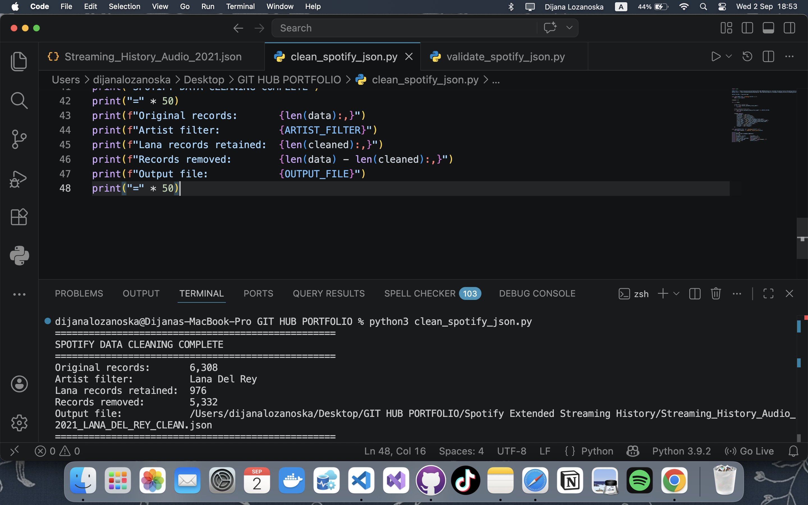
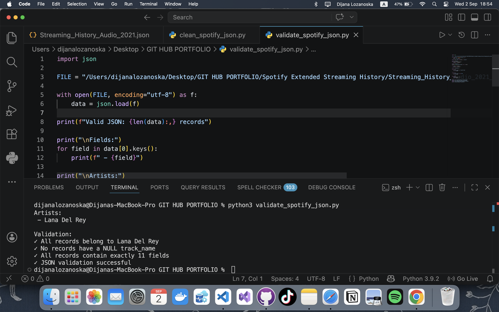

# 🎧 Lana Del Rey Spotify Listening Advanced Data Analytics Pipeline

**End-to-End Data Analytics Project**

`Python` • `Docker` • `Oracle SQL` • `Star Schema Modelling` • `ETL` • `Power BI` • `DAX`

---
## 📌 Project overview

This project presents an end-to-end analysis of Lana Del Rey listening activity using my own personal Spotify Extended Streaming History data, transforming raw JSON data into a dimensional data warehouse in Oracle SQL and an interactive Power BI dashboard. 

The project follows this general architecture:  

```
Spotify Extended Streaming History
                │
                ▼
        Raw JSON Data
                │
                ▼
     Python Data Cleaning
       VS Code / MacBook
                │
                ▼
       Cleaned JSON Data
                │
                ▼
      JSON Validation
                │
                ▼
      Docker / PowerShell / Windows
                │
                ▼
       Oracle Database
                │
                ▼
       PL/SQL Processing
                │
                ▼
      Dimensional Model
        Star Schema
                │
                ▼
          SQL Analysis
                │
                ▼
          Power BI
                │
                ▼
        DAX Measures
                │
                ▼
      Interactive Dashboard
```

## 📂 Project Structure

```
Spotify-Advanced-Data-Analytics/
│
├── datasets/
│   └── Streaming_History_Audio_2021_LANA_DEL_REY_CLEAN.json
│
├── python/
│   ├── clean_spotify_json.py
│   └── validate_spotify_json.py
│
├── sql/
│   ├── 01_create_staging.sql
│   ├── 02_load_json.sql
│   ├── 03_create_dimensions.sql
│   ├── 04_create_fact.sql
│   └── 05_analysis_queries.sql
│
├── powerbi/
│   ├── measures.dax
│   └── Spotify_Lana_Del_Rey_Analysis.pbix
│
├── screenshots/
│   ├── raw-data.png
│   ├── python-cleaning.png
│   ├── python-validation.png
│   ├── docker-file-transfer.png
│   ├── oracle-staging.png
│   ├── data-model.png
│   └── powerbi-dashboard.png
│
└── README.md

```
<!--

> Personal Spotify listening-history data is not included in the public repository. The repository contains the processing logic, SQL scripts, documentation and selected screenshots instead.

-->

---


## 1. 🛠️ Technologies Used

| Technology | Purpose |
| :--- | :--- |
| **Python** | Data cleaning and validation |
| **Visual Studio Code** | Python development environment |
| **Docker** | Oracle database container environment |
| **PowerShell** | File transfer between Windows host and Docker container |
| **Oracle Database** | Data storage, transformation and analytical modelling |
| **PL/SQL** | Database-side ETL and transformation |
| **SQL Developer** | Oracle database development and SQL execution |
| **Power BI** |	Business intelligence and visualization |
| **DAX** |	Analytical measures and calculations |
| **GitHub** |	Version control and portfolio documentation |

## 2. Data Source

The project uses Spotify Extended Streaming History data.

The original source contains individual listening events with information such as:

da se dodade od raw data screenshot
<!--
* **Timestamp**
* **Platform**
* **Playback duration**
* **Country**
* **Track**
* **Artist**
* **Album**
* **Playback start reason**
* **Playback end reason**
* **Shuffle status**
* **Skip status**
-->

The raw Spotify data contains records beyond the scope of this analysis, therefore a Python preprocessing stage was implemented before loading the analytical dataset into Oracle.

---

## 3. Python Data Cleaning

The first processing stage was performed locally on a macOS environment using Python and Visual Studio Code. The script loads the raw Spotify JSON payload, parses the stream collection, and filters it down to the target scope.

### Cleaning Objectives

The Python pipeline executes the following transformations:
1. **Filter Content:** Retains only music streaming records containing a valid track name.
2. **Isolate Artist:** Restricts the entire dataset exclusively to Lana Del Rey.
3. **Prune Schema:** Drops unnecessary source attributes to minimize the analytical payload.
4. **Normalize Fields:** Renames and maps variables into a clean, simplified structure.
5. **Serialize Output:** Exports the optimized dataset into a structural JSON file.

The target artist constraint is explicitly declared as:
```python
ARTIST_FILTER = "Lana Del Rey"
```

The records are evaluated and retained using the following structural logic:
```python
r.get("master_metadata_album_artist_name") == ARTIST_FILTER
```

### Cleaned Schema Structure
The resulting dataset is trimmed down to 11 core fields:

```yaml
- timestamp     - track_name    - reason_end
- platform      - artist_name   - shuffle
- ms_played     - album_name    - skipped
- country       - reason_start
```

* **Cleaned Dataset Export:** `Streaming_History_Audio_2021_LANA_DEL_REY_CLEAN.json`
* **Python Cleaning Script:** [`python/clean_spotify_json.py`](python/clean_spotify_json.py)

> **Execution Telemetry:** Upon completion, the script outputs runtime metrics detailing the *Original record count*, *Selected artist*, *Retained vs. removed records*, and the *Target output destination*.


---

## 4. Data Validation

Following the transformation layer, a dedicated validation suite is executed to guarantee data integrity before database ingestion.

### Core Validation Checks

* **JSON Validity:** Confirms the structural integrity of the file and verifies it loads successfully without parsing errors.
* **Artist Consistency:** Scans every single record to ensure absolute compliance with the filter criteria:
  ```python
  r["artist_name"] == "Lana Del Rey"
  ```
* **Track Completeness:** Assures data density by verifying that `track_name` contains zero null values.
* **Schema Uniformity:** Validates that every individual object block contains exactly **11 fields**.

###  Validation Output
When executed, the validation harness outputs the following status checks:
<!--
```diff
✓ All records belong to Lana Del Rey
✓ No records have a NULL track_name
✓ All records contain exactly 11 fields
✓ JSON validation successful
```
-->
* **Python Validation Script:** [`python/validate_spotify_json.py`](python/validate_spotify_json.py)


---

## 5. Docker & Oracle Data Ingestion

To ensure scalability and performance, the verified JSON dataset is bypassed around the graphical interface client (SQL Developer) and injected directly into the Oracle Database container core.

```bash
# Transferring the dataset from the host machine straight to the container filesystem
docker cp "C:\Users\Acer\Desktop\SQL\Data\Streaming_History_Audio_2021_LANA_DEL_REY_CLEAN.json" oracle-db-free:/tmp/spotify_staging.json
```

> **Design Architecture Decision:** Loading large JSON files directly through a client GUI caused me memory bottlenecks. Moving the payload directly into the container's virtual memory (`/tmp`) shifts processing overhead directly to the database server layer.

---

## 6. Oracle JSON Staging

The ingested JSON document is mounted into Oracle using a Character Large Object (`CLOB`) data type. An Oracle Directory object maps directly to the containerized `/tmp` file path, allowing native file system streaming via database pointers.

### Data Flow Architecture

da se dodade arhitekturata 

This decoupled staging abstraction layer separates the raw, unstructured file stream from subsequent relational staging logic.

---

## 7. JSON to Relational Mapping

Leveraging Oracle’s native `JSON_TABLE` relational expression engine, the static JSON array layout is broken down and mapped dynamically into relational database table rows.

### Relational Staging Layout
The target relational columns correspond directly to the source attributes:

da se dodade screenshot

This persistent, relational staging baseline serves as the raw source of truth for all subsequent SQL transformations and PL/SQL dimensional modeling workflows.

---


<!--
## 📂 Dataset

Main objective is to keep only artist Lana Del Rey records in the JSON file and remove private metadata.

---

## 🛠️  1. Data Cleaning — Visual Studio Code

### Data Cleaning Process


### Data Validation

-->
---

## 👩🏻‍💻 Author

**Dijana Lozanoska, MSc**  
Microsoft Certified SQL Data Analyst

Focus areas:

* SQL & PL/SQL
* Power BI
* DAX
* Data Analytics
* ETL
* Data Modelling
* Business Intelligence

##
⭐ This project is part of my data analytics portfolio and demonstrates practical application of Python, Oracle SQL/PLSQL, dimensional modelling and Power BI.

